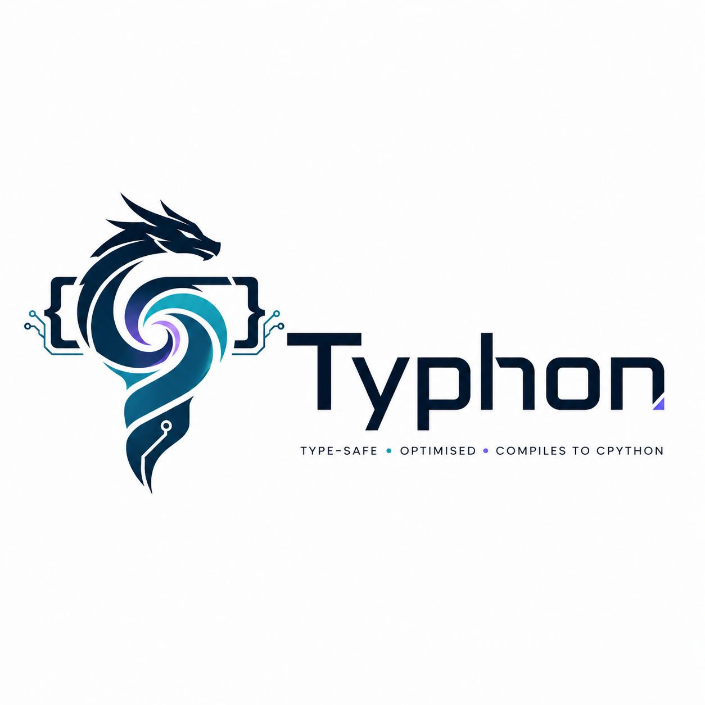

<div align="center">
  

  <h1>Typhon</h1>

  <p><strong>A statically-typed, stricter superset of Python that compiles to clean, readable CPython 3.13+ — with no runtime dependency on the toolchain.</strong></p>

  <p>
    <a href="https://github.com/codehalwell/Typhon/actions/workflows/ci.yml"></a>
    <a href="https://github.com/codehalwell/Typhon/actions/workflows/deploy-docs.yml"></a>
    <a href="https://github.com/codehalwell/Typhon/actions/workflows/vscode-extension.yml"></a>
    <a href="https://codehalwell.github.io/Typhon/"></a>
    
    
    
  </p>

  <p>
    <a href="https://codehalwell.github.io/Typhon/"><strong>Documentation</strong></a> ·
    <a href="docs/language.md">Language Reference</a> ·
    <a href="docs/cli.md">CLI Guide</a> ·
    <a href="docs/roadmap.md">Roadmap</a>
  </p>
</div>

---

> Every `.ty` file emits valid, idiomatic `.py`. Not all `.py` is valid Typhon.

The compiler and language server live in a single Rust binary called `tyc`.

## Install

Pre-built binaries ship on every release for **macOS (Apple Silicon + Intel)**, **Linux (x86_64 + aarch64, glibc)**, and **Windows (x86_64)**.

**macOS / Linux:**

```bash
curl -sSL https://raw.githubusercontent.com/codehalwell/typhon/main/install.sh | sh
```

**Windows (PowerShell):**

```powershell
iwr -useb https://raw.githubusercontent.com/codehalwell/typhon/main/install.ps1 | iex
```

The installers detect your platform, resolve the latest release from the GitHub API, verify the SHA-256 checksum, and drop `tyc` into a per-user directory (`$HOME/.local/bin` on macOS/Linux; `%LOCALAPPDATA%\Programs\Typhon` on Windows). On macOS the Gatekeeper quarantine attribute is cleared automatically; on Windows the install directory is added to the user-level `PATH`.

If you download an archive manually on macOS, clear the Gatekeeper quarantine attribute once before the first run:

```bash
xattr -d com.apple.quarantine ~/.local/bin/tyc
```

`tyc` itself runs anywhere a modern Rust toolchain produces a binary; the emitted Python **requires CPython 3.13 or newer** at runtime. Older targets are rejected at `typhon.toml` load time so projects can't accidentally build code their interpreter won't run.

For a longer-form guide (custom install dir, pinned version, uninstall, manual download, troubleshooting), see [docs/install.md](docs/install.md).

## Why

- **Static safety** — non-nullable by default, no implicit `Any`, explicit error handling via `Result[T, E]`.
- **Modern ergonomics** — `let`/`mut`, interfaces, sealed unions with exhaustive matching, guards, pipes, comptime, lazy loading.
- **Clean output** — emits idiomatic Python; deploy like any other Python project, no Typhon runtime to install.
- **First-class tooling** — one binary builds, checks, formats, and runs as an LSP with sub-100 ms incremental feedback.

## Documentation

📖 **The full documentation site lives at [codehalwell.github.io/Typhon](https://codehalwell.github.io/Typhon/)** — browsable guides, references, and tutorials generated from [`docs-site/`](docs-site/).

The canonical design doc is **[the long-term plan](docs/long-term-plan.md)** — goals, architecture, language design, roadmap, and risks in one place.

Focused references:

| | |
|---|---|
| [docs/architecture.md](docs/architecture.md) | Compiler pipeline, crate layout, toolchain choices |
| [docs/language.md](docs/language.md) | Type system, error handling, async, `let`/`mut`, comptime |
| [docs/cheatsheet.md](docs/cheatsheet.md) | 30-second syntax refresher (also `tyc cheatsheet`) |
| [docs/vm.md](docs/vm.md) | The in-process tree-walking VM (default execution mode for `tyc run`) |
| [docs/cli.md](docs/cli.md) | The `tyc` binary and its subcommands |
| [docs/configuration.md](docs/configuration.md) | `typhon.toml` reference |
| [docs/diagnostics/](docs/diagnostics/) | One page per `tyc::` code — also surfaced via `tyc explain <code>` |
| [docs/roadmap.md](docs/roadmap.md) | Phased delivery plan |
| [docs/risks.md](docs/risks.md) | Risks and mitigations |
| [docs/prior-art.md](docs/prior-art.md) | TypeScript, rust-analyzer, ty, Pyrefly, oxc, Ruff |
| [editors/vscode/README.md](editors/vscode/README.md) | VS Code extension — syntax highlighting and LSP client |

## Quick start

```bash
# Build the compiler
cd tyc
cargo build --release

# Scaffold a new project
./target/release/tyc init myapp

# Check and format Typhon source
./target/release/tyc fmt src/
./target/release/tyc check src/
```

## The `tyc` binary

| Command | Purpose |
|---------|---------|
| `tyc build` | Full pipeline: parse, check, analyse, desugar, emit, format. `--check` dry-runs the pipeline and lists every would-be-written file without touching disk |
| `tyc check` | Parse and type-check only — no emission. For CI use |
| `tyc fmt` | Format `.ty` source files in place. Runs the in-process whitespace normaliser and then pipes through `ruff format` when on `PATH` |
| `tyc lsp` | Run as a Language Server on stdio |
| `tyc init` | Scaffold a new project: `typhon.toml`, `src/`, `tests/`. The generated `src/main.ty` ships a frozen class + `impl` block + `Result`/`?`/`match` example |
| `tyc trace` | Map a Python traceback back to Typhon source via `.py.map` v2 source maps (per-statement `(out_line → ty_line)` table emitted by the printer) |
| `tyc profile` | Build then instrument every top-level function with call-count + wall-clock sampling; writes `typhon-profile.json` on interpreter exit |
| `tyc migrate` | Convert typed Python (`.py`) into Typhon (`.ty`): `Optional[T]`/`T \| None` → `T?`, module-level annotated assigns gain `let`/`mut`, `@dataclass` decorators and `from dataclasses import dataclass` are dropped |
| `tyc ty`      | Build the project and run Astral's `ty` checker against the emitted Python. Requires `ty` to be installed separately (`pip install ty`). |
| `tyc stubtest` | Build the project and run `python -m mypy.stubtest` against every emitted `.pyi`. Complements `tyc check --stubs` (AST diff) by catching dynamically-created members via runtime introspection. Requires `mypy` (`pip install mypy`). |
| `tyc repl`    | Interactive Typhon evaluator. Compiles each block through the full pipeline and executes against a Python interpreter |
| `tyc run`     | Execute a Typhon program. Defaults to the in-process `tyc-vm` tree-walking interpreter ([docs/vm.md](docs/vm.md)) — no `.py` is written, no CPython is spawned. `--compile` (alias `--no-vm`) falls back to the legacy build-then-exec path |
| `tyc debug`   | Build the project and launch the emitted Python under a debugger (default `pdb`). Repeatable `--break <ty-file>:<line>` translates Typhon source locations through `.py.map` and forwards them to the debugger |
| `tyc explain` | Print the diagnostic catalog entry for a `tyc::` code (mirrors `rustc --explain`). Catalog pages live under `docs/diagnostics/` and are linked from the `url(...)` clause on every diagnostic |
| `tyc cheatsheet` | Print the 30-second Typhon cheat sheet ([docs/cheatsheet.md](docs/cheatsheet.md)) to stdout |
| `tyc add` / `tyc remove` / `tyc sync` | Lightweight package-manager surface over `uv`: rewrite `[dependencies]` / `[dev-dependencies]` in `typhon.toml` and run `uv sync` to install |

See [docs/cli.md](docs/cli.md) for the full reference.

## Project status

**Current release: [v0.15.4](https://github.com/CodeHalwell/Typhon/releases/tag/v0.15.4)** — a bugfix release driven by a field report from building a layered FastAPI-style app. It closes the cross-module structural-conformance gap the reviewer called "the single biggest gap": a concrete class that reaches a consumer module only indirectly — as an imported provider's return type (`let r: Repo = get_repo()`) or behind a module-qualified annotation (`import m; r: m.Repo`) — is never seeded into the consumer's local shapes, so conformance saw zero members and wrongly fired `tyc::interface_not_conforming` (bare) or `tyc::type_mismatch` (qualified). The checker now resolves class/interface shapes through the project-wide module registry when they aren't locally seeded, so cross-module "depend on abstractions" matches same-module behaviour (and a non-conforming concrete still errors). It also fixes a `pub comptime let` / `pub comptime def` parse error (`pub` now stacks with `comptime`), and documents that `extend BUILTIN:` is module-local (unlike `extend ClassName:`, it doesn't cross imports — wrap it in a `pub def` free function instead). Additive; `tyc build` / `tyc run` output is byte-for-byte unchanged. Full notes: [CHANGELOG.md](CHANGELOG.md#0154--2026-06-15--cross-module-interface-conformance--pub-comptime-let).

**Previous release: [v0.15.3](https://github.com/CodeHalwell/Typhon/releases/tag/v0.15.3)** — a tooling release with no language, type-checker, VM, or emitted-runtime change. The `typhon` Claude skill now ships *inside the compiler*, and a new **`tyc install skill`** command vendors it into any project — it writes the whole skill tree (`SKILL.md`, seven sibling reference docs, and a new `references/` folder of 20 compile-clean example programs) into `.claude/skills/typhon/` of the current project. The skill is embedded in the binary at build time, so the command works offline with no source checkout (`--force` overwrites, `--dir` targets another root, `--list` previews). The bundled skill was also brought current with the v0.14.1 → v0.15.2 surface (corrected version labels, added release highlights, documented `tyc::gather_opportunity` / `try_result` / the `async_without_await` contract exemption). Full notes: [CHANGELOG.md](CHANGELOG.md#0153--2026-06-15--tyc-install-skill--bundled-skill-refresh).

**Previous release: [v0.15.2](https://github.com/CodeHalwell/Typhon/releases/tag/v0.15.2)** — a bugfix with no language or API change. The `as!` checked-cast preprocessor built its string/comment skip mask in two passes (string-first, comment-blind), so an apostrophe inside a `#` comment (`# assert each field's shape`) opened a phantom string that swallowed an `as!` / `?` on a following line and surfaced as a spurious `tyc::parse` error; multi-byte characters in such a comment (em-dash, bullet) shifted byte offsets the same way. The mask is now built in a single unified pass. Full notes: [CHANGELOG.md](CHANGELOG.md#0152--2026-06-14--as-comment-awareness-fix).

**Previous release: [v0.15.1](https://github.com/CodeHalwell/Typhon/releases/tag/v0.15.1)** — a performance and accessibility patch. Source map generation drops from O(N²) to O(N log N) via binary search (a 500× speedup on large files); `cases_cover_type` sheds two heap allocations per call. The docs site gains a visible focus ring on keyboard-navigable code blocks and a brief heading highlight on anchor-link navigation. No language or API changes. Full notes: [CHANGELOG.md](CHANGELOG.md#0151--2026-06-14--compiler-performance-and-docs-site-accessibility).

**Previous release: [v0.15.0](https://github.com/CodeHalwell/Typhon/releases/tag/v0.15.0)** — a feature release sharpening Typhon at the library boundary, driven by a field report from building a real async app. The `as!` checked cast now lowers **structurally**, so it composes in any expression position — nested in call arguments, inside comprehensions / collection literals, across multi-line value expressions, in `if` / `while` / `assert` conditions, and with union / parametric targets (`x as! int | None`, `d as! dict[str, int]`). A new prelude combinator **`try_result(thunk[, on_err])`** collapses the exception→`Result` shim into one expression (`return try_result(lambda: read_json(p), lambda e: f"bad: {e}")`), typed as `Result[T, E]` and working under both `tyc run` and the compiled path. The compiler now ships **curated bundled `.dty` stubs** for the most-imported third-party libraries (httpx, requests), seeded before venv introspection so they're type-checked out of the box — no `.venv` or `tyc sync` needed. `async_without_await` no longer fires on a method that is `async` only to satisfy an `interface` or override an async base method, and a cross-module class-identity fix lets a qualified `httpx.Response` annotation unify with the library's bare return type while keeping distinct modules' same-named classes apart. Full notes: [CHANGELOG.md](CHANGELOG.md#0150--2026-06-13--as-everywhere-try_result-and-compiler-bundled-library-stubs).

**Previous release: [v0.13.1](https://github.com/CodeHalwell/Typhon/releases/tag/v0.13.1)** — a six-fix patch on v0.13.0 from a round of app-building (plus two PR-review hardenings). The `?` operator applied to a bare (un-awaited) `async` call now errors with `tyc::missing_await` instead of silently miscompiling into a `.value` read off the coroutine; `await` unwraps a stored `asyncio.Task[T]` / `Future[T]` handle (suppressed for same-named user classes); `tyc run` resolves the whole project `src` tree before launching the VM instead of checking the entry file in isolation; the VM binds an imported `type` sealed-union alias as a module attribute (forward-declared aliases included, matching CPython's lazy `TypeAliasType`); `tyc fmt` is string-aware around a `#` inside a `freeze let` value; and `pub enum` parses. Full notes: [CHANGELOG.md](CHANGELOG.md#0131--2026-06-11--playground-stress-round-async-await-propagation-task-await-unwrap-vm-project-run-fmt-pub-enum).

**Release headline: [v0.13.0](https://github.com/CodeHalwell/Typhon/releases/tag/v0.13.0)** — stress-round fixes (cross-module `extend`, TypedDict-style dict-literal lowering, enum-match exhaustiveness, the extended Result API) plus a post-release code review of everything since v0.12.0. The review fixed ten issues across the VM, type checker, and resolver, headlined by two CPython-divergences — seeded `random.sample` (the selection-set threshold used the wrong log base, so seeded sequences diverged from `tyc build` + CPython) and `@staticmethod` / `@classmethod` reached through an instance (the receiver was wrongly bound, prepending the instance as a spurious first argument) — and an `incompatible_override` false positive that flagged a valid LSP-widening override for merely adding an optional parameter. Full notes: [CHANGELOG.md](CHANGELOG.md#0130--2026-06-11--stress-round-fixes--post-release-code-review-cross-module-extend-dict-literal-lowering-enum-exhaustiveness-result-api).

The prior release headline (**v0.12.0**) — VM comparison-protocol parity + deep compile-time library introspection. A VM-vs-CPython differential follow-up against v0.11.0 fixed a silent-wrong-output class where `sorted()` / `min()` / `max()` ignored a user `__lt__` (they now route through the same comparison path `list.sort()` already used, so a custom comparison dunder takes effect), and added the missing `dict.popitem()` / `dict.fromkeys()` / `str.maketrans()` / `str.translate()` builtins to the VM. The headline is **deep library introspection at compile time**: venv signature introspection now captures parameter and return *annotations* (scalars plus the nullable `Optional[X]` / `X | None` forms), so a wrong-typed argument to a fully-typed third-party dependency — **function or constructor** — is caught by `tyc check` / `tyc build` through the same `tyc::type_mismatch` machinery your own code uses (this also closed an in-project constructor-argument soundness hole). A declared dependency that can't be introspected (no venv, not installed, C-extension-only) now **warns instead of silently skipping its checks** (`[strictness] unintrospectable-dependency`, default `warn`). And Phase 1 of the typeshed-backed [`ty` integration](docs/ty-integration.md) landed — `[checker] external = "ty"` (or `--with-ty` on `tyc build` / `tyc check`) runs Astral's `ty` over the emitted Python, the only path that covers C-extension and stdlib APIs runtime introspection can't see (e.g. `os.path.join(1, 2)` now caught at build time), with `ty`'s diagnostics re-attributed to your `.ty` source. Conservative throughout: anything not confidently modelled degrades to a permissive `Unknown`, verified across the full 256-file example corpus with zero false positives. Full notes: [CHANGELOG.md](CHANGELOG.md#0120--2026-06-07--vm-__lt__-parity-dictstr-builtins-and-deep-library-introspection).

**Previous release: [v0.11.0](https://github.com/CodeHalwell/Typhon/releases/tag/v0.11.0)** — VM parity sweep + `enum` keyword. A fresh adversarial stress round against v0.10.0 surfaced 22 findings — almost entirely in the VM — and this release closes every one. The headline is the new **`enum` keyword**: `enum Shape: CIRCLE / SQUARE` sugars over `enum.Enum`, auto-numbering bare members with `enum.auto()` (explicit `RED = 1` preserved), with `tyc fmt` round-trip support and a native VM `enum` shim. Two new VM value kinds land: `Value::Complex` (real complex arithmetic with reflected dunders and hashable set/dict keys) and a dict-view kind so `dict.keys()` / `.values()` / `.items()` repr (`dict_keys([...])`), iterate, `len`, and `in`-test like CPython. Bare `super()` is rewritten to the two-arg form (so `@dataclass(slots=True)` no longer orphans the `__class__` cell), `__call__` / `__post_init__` dispatch, multi-level inheritance accumulates fields across the full MRO, and the VM gains native `datetime` (naïve/UTC), `pathlib`, and `collections.defaultdict` (factory actually invoked) shims plus banker's `round`, real `re.Match` capture groups, and `str %` / f-string `%` formatting. Crucially, **VM value semantics now match CPython** — value-based dataclass equality (keyed on class identity), `Name(field=value)` repr, hashable instances, order-independent set equality, and shortest-round-trip float repr were all silent-wrong outcomes under v0.10.0 and are now fixed. The type checker also tightens: `None` flows into `object`, `str %` is type-checked, and `(5).items()` / `5["a"]` / `for x in 5:` fire at check time. Full notes: [CHANGELOG.md](CHANGELOG.md#0110--2026-06-04).

**Previous release: [v0.10.0](https://github.com/CodeHalwell/Typhon/releases/tag/v0.10.0)** — VM completeness release. Stress-testing the tree-walking VM past v0.9.2 surfaced a batch of correctness and coverage gaps that prevented `tyc run` from being a drop-in replacement for `tyc build && python` on real-world programs. The VM now dispatches dunders (`__add__` + reflected forms, rich comparisons `__eq__` / `__lt__` / …, `__str__` / `__repr__` / `__len__` / `__getitem__` / `__contains__`) on user instances, runs finite generators eagerly (`yield` / `yield from`, capped at 1M items), and models `type(x)` as a real type object so `type(x).__name__` and `type(x) == int` work. `@property` getters fire on attribute read, `@classmethod` binds `cls`, and both are inherited through bases. The long tail of missing builtins — `divmod`, `pow` (2- and 3-arg), `format`, `ascii`, `int(str, base)` (incl. base=0), set algebra (`union`/`intersection`/`difference`/`symmetric_difference`/…), missing string methods (`center`/`ljust`/`rjust`/`zfill`/`partition`/`removeprefix`/`expandtabs`/…), `json.dumps(indent=…)`, `time.perf_counter`, `time.process_time` — all land. `max`/`min`/`list.sort` accept `key=`/`reverse=`/`default=` kwargs via a kwargs sentinel. Pydantic `Model.model_validate` / `model_dump` / `model_dump_json` make flat `model` classes usable under `tyc run`. The type checker plugs three exhaustiveness / augmented-assign false positives, and `tyc-emit` shaves heap allocations out of the literal-emission hot path. Full notes: [CHANGELOG.md](CHANGELOG.md#0100--2026-06-01).

**Previous release: [v0.9.2](https://github.com/CodeHalwell/Typhon/releases/tag/v0.9.2)** — bugfix point release closing a cross-module regression surfaced by the v0.9.1 MNIST CNN stress sweep. A `class! Sub(Foreign):` (e.g. `class! HttpError(Exception): code: int`) declared in one module and imported by another false-positived `tyc::attribute_not_found` on every inherited / framework-provided attribute access; the same access pattern stayed (correctly) lenient in-module. The fix seeds `class_parents` from `InterfaceShape.bases` during cross-module shape ingestion so the four hierarchy walkers (`class_hierarchy_fully_known`, `find_method`, `find_field`, `class_inherits_from`) see the same parent chain across module boundaries that they see in-module — the v0.7.1 foreign-base leniency now kicks in correctly cross-module. Scoped to `tyc-types`'s `check_module_with_imports`; no language, runtime, or diagnostic-surface changes. Full notes: [CHANGELOG.md](CHANGELOG.md#092--2026-05-27).

**Previous release: [v0.9.1](https://github.com/CodeHalwell/Typhon/releases/tag/v0.9.1)** — bugfix point release closing two issues surfaced by a v0.9.0 stress sweep on a multi-package PyTorch app: `tyc fmt` could rewrite valid source into invalid (and in one case silently-empty) output via four related corruption modes (`impl Alias:` for sealed-union aliases, `frozen` class modifier, `pub *` lines, and multi-line kwarg `=` respacing); and an exhaustive `match` over a sealed-union variant imported through a `pub *` package facade incorrectly fired `tyc::missing_return` because the consumer's `sealed_unions` registry wasn't seeded through the facade. Both fixes are scoped to `tyc-format` and `tyc check` / `tyc build`'s shape-map plumbing — no language, runtime, or diagnostic-surface changes. Full notes: [CHANGELOG.md](CHANGELOG.md#091--2026-05-27).

**Previous release: [v0.9.0](https://github.com/CodeHalwell/Typhon/releases/tag/v0.9.0)** — the stress-test cleanup release closing **32 findings** from a v0.8.1 stress sweep across the type checker, VM, parser, lowering passes, diagnostics, and CLI. The VM is now usable as the daily-driver runner the docs always advertised: `Result` combinators, `open()` write/append/binary modes, class patterns on built-ins, `frozenset` as a dict key, deep `freeze let`, comptime inlining, `lazy import`, `class!` exception fields, dataclass mutable-default factories, `collections.deque` / `heapq` / `contextlib` / `pydantic` shims, multi-file projects, `@property` / `super()` / `@contextmanager` — all work under `tyc run` now. The type checker plugs silent-correctness gaps in Sequence covariance, variant-to-parametric-union flow, `while True:` reachability, post-loop narrowing, `assert` narrowing, `*args` annotation policy, `extend list[T]` dispatch, exhaustive match on `T?`, `with`-chain error mismatch, and the `comptime let T: type` alias. Previous releases: [v0.8.1](https://github.com/CodeHalwell/Typhon/releases/tag/v0.8.1) / [v0.8.0](https://github.com/CodeHalwell/Typhon/releases/tag/v0.8.0) / [v0.7.1](https://github.com/CodeHalwell/Typhon/releases/tag/v0.7.1) / [v0.7.0](https://github.com/CodeHalwell/Typhon/releases/tag/v0.7.0). Highlights since v0.8.1:

- 🟢 **VM `Result` combinators** (`.map` / `.map_err` / `.and_then` / `.or_else`) now work on `Ok`/`Err` instances via bound `NativeFn` wrappers — previously a typecheck-clean program crashed under `tyc run` with `AttributeError: Ok has no attribute 'and_then'`.
- 🟢 **VM `open()` learned write / append / binary modes** plus `__enter__` / `__exit__` / `flush()` on the resulting file. `json.load` / `json.dump` ride on top, so the standard load-modify-save script pattern works in `tyc run`.
- 🟢 **VM class patterns on built-in types** (`case str() as s:`, `case int() as n:`, …) now match. The exhaustiveness checker also recognises `case None:` + `case str() as s:` as covering `str?`.
- 🟢 **VM `frozenset(...)` is hashable as a dict key** (new `HashKey::FrozenSet` variant with insertion-order-independent hashing).
- 🟢 **VM `freeze let CFG = {...}` actually freezes** the value: list → tuple, dict → mappingproxy-tagged dict, recursive. Mutations through aliased references raise the same `TypeError` CPython's MappingProxy does. The check pass also pre-validates the RHS shape so non-`frozen` user-class constructors fail at `tyc check` instead of import time.
- 🟢 **VM `comptime let X = ...` inlines** via the substitution pass shared with `tyc build` — `comptime let PORT = int(env(...))` no longer crashes with `NameError: env is not defined` under `tyc run`.
- 🟢 **VM `lazy import np = numpy`** uses the simpler `import M as N` rewrite (the descriptor-based proxy class the build path emits has nothing to bind against in a tree-walking VM).
- 🟢 **VM `class!` synthesised `__init__` runs.** `except HttpError as e: print(e.code)` works against `class! HttpError(Exception): code: int`; the handler binds the user `Instance`, and exception-type matching walks the MRO via `class_inherits_from`.
- 🟢 **VM `dataclasses.field(default_factory=list)` invokes the factory per instance**, so `tags: list[str] = []` no longer shares one list across every instance.
- 🟢 **VM native shims for `collections.deque`, `heapq`, `contextlib`, `pydantic`.** Graph / queue / heap algorithms, `@contextmanager` identity decorators, and `model` class declarations all run cleanly. `deque` rides on `Value::List` via new `popleft` / `appendleft` / `extendleft` / `rotate` methods. `pydantic.BaseModel` is a placeholder so declaring a `model` doesn't `ImportError`.
- 🟢 **VM `@property` / `@classmethod` / `@staticmethod` / `super()`** are present as identity-ish stubs so decorated methods no longer crash on import.
- 🟢 **Multi-file projects run under both `tyc run` modes.** The VM loads sibling `.ty` modules from the project source root, honours relative imports (`from .repo import x`), and caches each module's bindings as a `Value::Module`. `tyc run --compile` now spawns `python -m <pkg>.main` so relative imports in the entry point resolve correctly.
- 🟢 **Read-view covariance.** `list[Subclass]` / `tuple[Subclass]` / `set[Subclass]` / `frozenset[Subclass]` flow into `Sequence[Super]` / `Iterable[Super]` / `Iterator[Super]` / `Collection[Super]` / `Container[Super]` / `Reversible[Super]`. Mapping / MutableMapping cover `dict[K, V]` (K invariant, V covariant).
- 🟢 **Variant → parametric sealed union assignability.** `Cons[T]` / `Cons` (where `type LL[T] = Cons[T] | Nil`) is assignable into `LL[T]`. Required for recursive ADT walks like `mut cur: LL[T] = self`.
- 🟢 **`while True:` reachability + post-loop narrowing.** A loop whose body always returns / raises on every branch with no `break` is recognised as exiting; the post-loop point is unreachable so `missing_return` doesn't fire. After `while y is None: y = load()` (no `break`), the post-loop `y` is narrowed to non-None.
- 🟢 **`assert x is not None` narrows** — the standard Python static-checker idiom now works.
- 🟢 **`*args` / `**kwargs` require annotations** (Rule 1). Canonical idiom is `*args: object` / `**kwargs: object`.
- 🟢 **`extend list:` dispatches on `list[T]`-annotated receivers.** The synthetic `__typhon_builtin_ext_list` class shape is consulted before `attribute_not_found` fires.
- 🟢 **`with`-chain explicit `else err: return Err(err)` validates the error type** against the function's declared return — previously the check was gated on the synthetic `?`-op temp shape, so a `with`-chain could silently return the wrong error class.
- 🟢 **`func[T](args)` explicit type instantiation** now fires a clear check-time error (was: runtime `'function' object is not subscriptable`).
- 🟢 **`comptime let T: type = int`** lowers to a PEP 695 `type T = int` alias so `T` is substitutable wherever a type is expected. `tyc check` runs the substitution before parsing so check, build, and VM all see the same shape.
- 🟢 **`pub *` name collisions surface in `tyc check`.** The detection logic from `tyc build` is exposed as `detect_pub_star_diagnostics` so CI catches collisions before they reach build.
- 🟢 **Sealed-union impl distribution dedupe.** `impl Alias:` over a sealed union duplicates each method body across every variant; the type-checker dedupes diagnostics by `(code, rendered message)` so a 10-variant union no longer reports 10 identical errors.

Earlier release highlights (v0.8.0):

- 🟢 **`tyc::attribute_not_found` now fires on class instances and generic classes**, not just `TypeVar`-bounded parameters. Foreign / venv-introspected classes keep the permissive degrade-to-`Unknown` behaviour via a new `partial` shape marker, so adapters around external libraries don't get false positives. Skipped in `unsafe:` regions and for dunder / leading-underscore names.
- 🟢 **Interface parameter type conformance.** `interface_missing_members` now compares parameter types position-by-position (contravariant on params) in addition to arity, so an `interface Repo: def save(self, item: str) -> bool` claim with a `def save(self, item: int) -> bool` impl is rejected at conformance time.
- 🟢 **`Type::LitStr(String)` — string-literal singleton types.** `type Color = "red" | "green" | "blue"` and `Literal["a", "b"]` produce `LitStr` slots; assignability rejects `paint("orange")` against `Color`. Bidirectional inference widens string literals to `LitStr` only when the expected type carries one.
- 🟢 **Arbitrary-precision integers in the VM.** `Value::Int` is now backed by `num_bigint::BigInt`; `2 ** 100` and `fib(99)` produce mathematically-correct results. Behaviour change: programs that relied on i64 wrap-around will compute different (correct) values.
- 🟢 **Dict insertion order preserved in the VM.** `RcDict` is now an `indexmap::IndexMap`; the same `.ty` file no longer prints dicts in different orders under `tyc run` vs `tyc build && python build/main.py`.
- 🟢 **f-string format flags fully wired in the VM.** Zero-pad, alternate-form (`0x` / `0o` / `0b`), `[fill]align`, sign, width, comma, precision, and type all match CPython output.
- 🟢 **Mapping match patterns and sequence-with-star patterns** (`case {"type": "circle"}`, `case [x, *rest, y]`) implemented in the VM.
- 🟢 **Larger native VM stdlib.** Adds `re`, `typing`, `collections` (`OrderedDict`, `defaultdict`, `Counter`, `namedtuple`), `functools` (`lru_cache`, `cache`, `cached_property`, `reduce`, `partial`), `itertools` (`chain`, `count`, `cycle`, `accumulate`, `combinations`, `permutations`, `product`, `islice`, `takewhile`, `dropwhile`, `groupby`), `dataclasses`, and `pathlib`. Caveats documented inline.
- 🟢 **Subclass constructors inherit fields in the VM.** `class Dog(Animal): breed: str` accepts `Dog(name=…, age=…, breed=…)` under `tyc run`.
- 🟢 **Parser scaffolds the docs already advertised:** HKT `class Functor[F[_]]:`, `impl[T] SealedUnionAlias[T]:` distributing methods across every variant, `class X[T] frozen:`, `async def` in `interface` bodies auto-completing the `: ...` body, outer-annotation tuple unpack `let (a, b): tuple[int, str] = …`.
- 🟢 **`?` propagation inside `with`-chains.** `result_error_mismatch` now fires when the implicit return form of `with x = f()?: …` routes a mismatching error type through the chain.
- 🟢 **`tyc::pattern_shadows_outer`** fires when a `match` capture binds a name that already exists in the outer scope.
- 🟢 **Diagnostics polish.** Synthetic preprocess lines no longer leak into source listings (`SanitisedDiagnostic` wrapper); dedicated parse-error hints for multi-line `|>` chains and `freeze let` at non-module scope; `wrong_arg_count` rephrasing for kw-only mismatches; collection variance hints suggest `Sequence[Animal]`; dict-to-model mismatch points users at the constructor form.
- 🟢 **New lint warnings:** `tyc::empty_collection_no_annotation` (`let xs = []`), `tyc::typing_alias_in_annotation` (bare `List[…]` / `Optional[…]` / `Dict[…]` / `Union[…]`), `tyc::contains_secret_literal` (inline string literals named `*_(TOKEN|SECRET|PASSWORD|PWD|KEY|API_KEY)`).
- 🟢 **CLI polish.** `tyc check lib.dty` now accepts a single `.dty` file directly; `tyc run --compile` rejects single-file inputs up-front with an actionable error; `tyc migrate` strips trivial `__init__` methods and emits the resulting class as plain `class` (not `class!`), preserving any leading docstring.
- 🟢 **Changed defaults.** `unused_import` default severity is now `warn` (was `error`). Set `[strictness] unused-import = "error"` in `typhon.toml` to restore the old default.

Full release notes: [CHANGELOG.md](CHANGELOG.md#090--2026-05-27). v0.9.0 is additive on the accepted surface — every previously-accepted program continues to type-check, and the new VM features expand what `tyc run` accepts rather than narrowing it. Open frontier work (full HKT unification, general inter-procedural field-init audit, and preprocess-line-number remapping for impl-sealed-union diagnostics) is unchanged from v0.5.0 — see [`TYPE_SYSTEM_FRONTIER.md`](TYPE_SYSTEM_FRONTIER.md) and [`docs/roadmap.md`](docs/roadmap.md).

---

**Phase 0 — Foundation** substantially complete:

- ✅ Cargo workspace skeleton with `crates/` directories
- ✅ `let`/`mut` keyword tokens (immutable and mutable bindings)
- ✅ `tyc fmt` — parses and validates `.ty` source, normalises whitespace
- ✅ `tyc check` — validates syntax and emits miette diagnostics
- ✅ `tyc init` — scaffolds new projects with `typhon.toml`
- ✅ Ruff parser fork vendored under `tyc/vendor/` with first-class
  `let`/`mut` soft-keyword support and a `Mutability` field on assignment
  AST nodes. All consumer crates now use `ruff_python_ast` via
  `tyc_syntax::parse_module`; the migration off `rustpython-parser` is
  complete — see [`tyc/vendor/README.md`](tyc/vendor/README.md) for details.
- ✅ `tyc ty` — optional integration that builds the project and runs
  Astral's [`ty`](https://github.com/astral-sh/ty) type checker against
  the emitted Python for a second opinion.

**Phase 1 — Core types** complete:

- ✅ Salsa db with `preprocessed_text` and `module_decl_names` queries
- ✅ Name resolution and scope construction; `let`/`mut` enforcement
- ✅ Nominal types: function signatures, assignment compatibility, primitives, classes
- ✅ Non-nullable by default with flow narrowing on `is None` / `is not None` / `isinstance`
- ✅ `T?` syntax sugar for `T | None` in annotations
- ✅ `tyc check` emits "unknown name", "type mismatch", and "nullable use" diagnostics via miette

**Phase 2 — Class and value features** complete:

- ✅ Class emission as `@dataclass(slots=True)`; `model` keyword emits Pydantic with `extra='forbid'` by default
- ✅ Sealed unions and exhaustive `match`
- ✅ `Result[T, E]`, `Ok`/`Err` constructors, generated `typhon_runtime.py` helper
- ✅ `?` operator for `Result` error propagation (context-checked against the enclosing function's return type)
- ✅ `with`-chain Result sequencing with optional `else err:` block
- ✅ `comptime let/mut` with `env()` lookup; required env vars declared in `[env]`
- ✅ `impl` blocks merged into class definitions at desugar
- ✅ `tower-lsp-server` LSP backend: `tyc lsp` publishes diagnostics on `did_open` / `did_change`, serves position-based hover (binding kind + mutability), and answers go-to-definition by jumping to the resolver's recorded declaration site.

**Phase 3 — Structural typing and advanced features** complete:

- ✅ Generics syntax locked to PEP 695 (`def f[T](x: T)`, `type Vec[T] = list[T]`). Type params resolve in scope and are preserved as `Type::TypeVar(name)` through signatures. Call-site bidirectional inference binds typevars from actual arguments (recursively, e.g. `list[T]` against `list[int]` infers `T=int`; conflicting bindings widen to a union) and substitutes them in the return type. Multi-arg constraint solving and bounded type-var checking are wired up; full variance and higher-kinded forms remain partial.
- ✅ `interface Name:` lowers to `class Name(Protocol):` with a structural conformance check on assignment that walks the candidate's MRO and matches field types. `isinstance(x, Interface)` is rejected by default.
- ✅ `unsafe:` lexical region: lowers to `if True:` for scope preservation, and the type checker tracks `unsafe_depth` to suppress diagnostics inside the block so users can interface with untyped Python without fighting the checker. Boundary checks at assignment sites outside the block apply normally.
- ✅ `@pure`/`@memo`/`@pure(memo=True)` decorators trigger the six-condition purity check; memoised functions get `@functools.cache` injected at desugar time. Project-wide opt-in via `[strictness] auto-memoise`.
- ✅ `gather:` lowers to `asyncio.TaskGroup` by default; `gather(strategy="best-effort"):` to `asyncio.gather(..., return_exceptions=True)`.
- ✅ `go f(x)` lowers through `typhon_runtime.tasks.spawn` with a strong-ref task registry.
- ✅ `lazy import np = numpy` lowers to a thread-safe inline proxy class; `lazy from … import …` is rejected. Module-level `lazy let NAME: T = expr` lowers to a sentinel-cached `lazy_let(lambda: expr)`; class-body `lazy let` lowers to `@cached_property`.
- ✅ Pipe operator `a |> f |> g(arg)` desugars to `g(f(a), arg)`.
- ✅ `extend ClassName:` (alias for `impl` on user-defined classes); `extend BUILTIN:` for `str`/`list`/`dict`/… extracts each method to a module-level free function and rewrites call sites whose receiver carries a matching static annotation. No monkey-patching of built-ins.
- ✅ `.dty` stub files compile to PEP 561 `.pyi`. `tyc check --stubs` parses every `.dty` and diffs its surface API (functions, classes, methods, annotated fields, parameter shapes) against the sibling `.ty`/`.py` implementation, emitting `tyc::stub_mismatch` diagnostics for missing-in-impl / missing-in-stub / signature-mismatch findings. A runtime introspection probe (mypy's `stubtest` proper) is still a follow-up.

**Phase 6 — Python-annoyances surface** complete ([v0.3.0](https://github.com/CodeHalwell/Typhon/releases/tag/v0.3.0), correctness follow-ups in [v0.3.1](https://github.com/CodeHalwell/Typhon/releases/tag/v0.3.1), [v0.4.0](https://github.com/CodeHalwell/Typhon/releases/tag/v0.4.0), [v0.5.0](https://github.com/CodeHalwell/Typhon/releases/tag/v0.5.0), [v0.5.1](https://github.com/CodeHalwell/Typhon/releases/tag/v0.5.1), [v0.5.2](https://github.com/CodeHalwell/Typhon/releases/tag/v0.5.2), [v0.6.0](https://github.com/CodeHalwell/Typhon/releases/tag/v0.6.0), [v0.6.1](https://github.com/CodeHalwell/Typhon/releases/tag/v0.6.1), [v0.7.0](https://github.com/CodeHalwell/Typhon/releases/tag/v0.7.0), [v0.7.1](https://github.com/CodeHalwell/Typhon/releases/tag/v0.7.1), [v0.8.0](https://github.com/CodeHalwell/Typhon/releases/tag/v0.8.0), [v0.8.1](https://github.com/CodeHalwell/Typhon/releases/tag/v0.8.1), [v0.9.0](https://github.com/CodeHalwell/Typhon/releases/tag/v0.9.0), [v0.9.1](https://github.com/CodeHalwell/Typhon/releases/tag/v0.9.1), [v0.9.2](https://github.com/CodeHalwell/Typhon/releases/tag/v0.9.2), [v0.10.0](https://github.com/CodeHalwell/Typhon/releases/tag/v0.10.0), [v0.11.0](https://github.com/CodeHalwell/Typhon/releases/tag/v0.11.0), and [v0.12.0](https://github.com/CodeHalwell/Typhon/releases/tag/v0.12.0)):

- ✅ **`newtype Name = Base`** — TypeScript-style nominal aliases over primitives. `UserId` flows freely into an `int` slot, but a bare `int` requires explicit `UserId(x)` construction to satisfy a `UserId`-typed target. Compiles to a zero-cost `typing.NewType` call. New `tyc::newtype_violation` diagnostic.
- ✅ **`freeze let X = expr`** — deep-immutable bindings. Wraps the RHS in `typhon_runtime.freeze.deep_freeze`, recursively replacing `list → tuple`, `dict → MappingProxyType`, `set → frozenset` so the value (not just the name) is locked.
- ✅ **`pub` modifier** — module-level visibility marker. When any name is `pub`, desugar synthesises a top-of-file `__all__ = [...]` list so `from foo import *`, Sphinx autoapi, and IDE re-export filters all see the public surface.
- ✅ **`tyc::blocking_in_async`** — flags direct calls to known-blocking stdlib functions (`time.sleep`, `requests.get`, `subprocess.run`, `input`, …) inside `async def` bodies.
- ✅ **`tyc::resource_not_managed`** — flags bare assignments of `open` / `socket.socket` / `sqlite3.connect` / `tempfile.*` calls that aren't wrapped in a `with` statement.
- ✅ **`tyc::div_by_zero_literal`** — catches `x / 0`, `x // 0`, `x % 0` at compile time when the divisor is a literal.
- ✅ **Cross-platform install** — pre-built `tyc` binaries for Linux (x86_64 + aarch64) and Windows (x86_64) join the macOS matrix. New `install.ps1` PowerShell installer for Windows; the existing `install.sh` now detects Linux and chooses the matching tarball.
- ✅ **Findings sweep** — every open finding from the May 2026 stress campaigns (O2–O29) closed or verified-fixed. `tyc fmt` gains five PEP 8 rules, TypedDict-style dict literals type-check against class shapes, inline `?` works (`Ok(add(parse(s)?, parse(t)?))`), `Sized`-style Protocols match built-in containers, `tyc migrate` rewrites `Union[T, None]` → `T?`, VM Result repr matches CPython, and more — see [CHANGELOG.md](CHANGELOG.md) for the full list.

**Phase 5.5 — Constructor / method arity safety** complete ([v0.2.0](https://github.com/CodeHalwell/Typhon/releases/tag/v0.2.0)):

- ✅ `tyc::arg_count` now fires on **class constructors**: a `class ApiClient: api_key: str` instantiated as `ApiClient(base_url="…")` is rejected at `tyc check` / `tyc build` time instead of crashing at runtime with `TypeError: missing 1 required positional argument`. Required fields, `T?` without `= None`, and `model` (Pydantic) classes are all checked.
- ✅ `tyc::arg_count` now fires on **`impl` methods**: `u.greet()` is flagged when `greet` declares a required `prefix: str` parameter. Previously method calls fell into the permissive arity shape.
- ✅ **Cross-module arity propagation:** `from foo import ApiClient` and `import foo as f; f.ApiClient(…)` both flow through the new arity checks. `.ty` source and `.dty` stubs participate on equal footing (stubs win on collisions). Works in `tyc check`, `tyc build`, and the LSP.
- ✅ **Salsa-cached LSP shape extraction:** a new `tyc_db::module_shapes_query(file)` salsa-tracked query caches per-file shape extraction. A keystroke in one file only re-runs extraction for that file.
- ✅ **`tyc::missing_field_init`** post-construction audit: catches the `X.__new__(X)` / `object.__new__(X)` bypass pattern when the instance escapes the function (return / call argument) without every required field assigned. Dropped conservatively on `setattr`, on method calls, and inside `unsafe:` regions.

**Phase 5 — Interop and developer experience** complete ([v0.1.6](https://github.com/CodeHalwell/Typhon/releases/tag/v0.1.6)):

- ✅ `plain class X:` keyword for "regular Python class, no `@dataclass`, no synthesised `__init__`" — the symmetric escape hatch alongside `frozen class` and `class!`.
- ✅ Auto-skip `@dataclass` injection for `Enum` / `IntEnum` / `StrEnum` / `Flag` / `IntFlag` / `ABC` / `ABCMeta` subclasses; project-specific bases via `[emit] skip-decoration-bases`.
- ✅ `[emit] class-default` rejects unknown values at config load (`tyc::invalid_config_value`) instead of silently falling back to `"dataclass"`.
- ✅ Python-semantic alignment: `or`/`and` typed as `Union[truthy(lhs), rhs]` (and the falsy dual), generator functions structurally assignable to `Iterable[T]` / `Iterator[T]` / `AsyncIterable[T]` / `AsyncIterator[T]`.
- ✅ `tyc explain <code>` prints diagnostic catalog entries (mirrors `rustc --explain`); `tyc cheatsheet` prints the 30-second syntax refresher.
- ✅ `tyc init` scaffold ships a frozen-dataclass + `impl` block + `Result`/`?`/`match` example, plus a fully-commented `typhon.toml`.
- ✅ `.py` files in `src/` are copied verbatim into the build output; a relative `.py` import that resolves outside `src/` fires `tyc::orphan_py_import`.
- ✅ Diagnostic deep-links: every `tyc::` diagnostic carries a miette `url(https://typhon.dev/lang/diagnostics/<code>)` clause and the 50+ catalog pages under [docs/diagnostics/](docs/diagnostics/) are embedded into the binary for `tyc explain`.
- ✅ `tyc build --check` dry-run mode lists every file that would be written without touching disk; `tyc::contains_secret_literal` flags inlined env values whose binding name matches a credential suffix.
- ✅ `tyc fmt` wraps `ruff format` after the in-process whitespace pass (when `ruff` is on `PATH` and the buffer contains no Typhon-only tokens).
- ✅ `tyc debug --break <ty-file>:<line>` translates Typhon source locations through `.py.map` and injects `-c "break …"` into the chosen debugger session.

**Phase 4+ — Beyond v1** also landed:

- ✅ Automatic `asyncio.gather` inference (opt-in via `[strictness] auto-gather`): straight-line runs of two-or-more independent `await` calls inside an `async def` are folded into a `TaskGroup`.
- ✅ Loop parallelisation for pure list comprehensions on free-threaded Python (opt-in via `[strictness] auto-parallel`, threshold `parallel-min-size`).
- ✅ PGO via `tyc profile` (opt-in via `[strictness] pgo-memoise`): `tyc build` reads `typhon-profile.json` and promotes pure functions whose call counts meet `pgo-min-calls` to `@functools.cache`.
- ✅ LSP completions (visible bindings + Typhon keywords + common builtins + venv-driven member-access introspection + from-import members from sibling files) and a "Remove unused import" code-action quick-fix.
- ✅ Cross-file go-to-definition across `.ty`/`.py` boundaries via the resolver's Salsa-tracked `resolved_module` query.
- ✅ Attribute resolution against class definitions (`obj.method`, `Class.field`) and re-export-aware import resolution.
- ✅ `tyc migrate` (typed Python → Typhon), `tyc repl` (interactive evaluator), `tyc debug` (pdb launcher with `--break`), and `tyc add`/`remove`/`sync` (uv-backed package manager).
- ✅ `tyc-vm`: in-process tree-walking interpreter that runs `.ty` source directly. `tyc run` uses it by default — no `build/`, no CPython process spawn. See [docs/vm.md](docs/vm.md) for the supported feature surface; programs that import CPython-only libraries fall back via `tyc run --compile`.
- ✅ Source-map line accuracy: `.py.map` records a per-statement `(out_line → ty_line)` table consumed by `tyc trace` and `tyc debug --break`.

See [docs/roadmap.md](docs/roadmap.md) for the phased plan, [CHANGELOG.md](CHANGELOG.md) for release-by-release notes, and [docs/findings.md](docs/findings.md) for the consolidated stress-test findings and open follow-ups.

## Configuration

`typhon.toml` at the project root drives every subcommand:

```toml
[project]
name = "myapp"
version = "0.1.0"
src = "src"
out = "build"

[python]
target = "3.13"
free-threaded = false

[emit]
class-default = "dataclass"  # or "pydantic"
format = true

[strictness]
no-implicit-any = true
unused-import = "error"
exhaustive-match = "error"
```

Full reference: [docs/configuration.md](docs/configuration.md).

## Workspace layout

```
tyc/
├── Cargo.toml                  (workspace root)
├── crates/
│   ├── tyc-syntax/             Typhon lexer/parser
│   ├── tyc-db/                 Salsa incremental database
│   ├── tyc-resolve/            Name resolution and scope construction
│   ├── tyc-types/              Nominal type checker with non-null narrowing
│   ├── tyc-analyse/            Purity, async, comptime (Phase 2+)
│   ├── tyc-desugar/            Typhon AST → Python AST (Phase 2+)
│   ├── tyc-emit/               Python codegen
│   ├── tyc-format/             Source formatter (in-process pass + `ruff format` wrap)
│   ├── tyc-diagnostics/        miette-based diagnostics
│   ├── tyc-lsp/                LSP backend
│   ├── tyc-vm/                 In-process tree-walking interpreter (default for `tyc run`)
│   ├── tyc-venv/               Venv signature introspection → ModuleShapes (shared by CLI + LSP)
│   └── tyc/                    CLI binary
└── vendor/                     Vendored crates — Typhon's fork of Ruff
    ├── ruff_text_size/         TextSize/TextRange newtypes
    ├── ruff_source_file/       Line-index over a source string
    ├── ruff_python_trivia/     Whitespace + comment helpers
    ├── ruff_python_ast/        Python AST + Typhon's Mutability extension
    └── ruff_python_parser/     Lexer + parser with let/mut soft keywords
```

See [docs/architecture.md](docs/architecture.md) for the pipeline and crate-by-crate breakdown.
